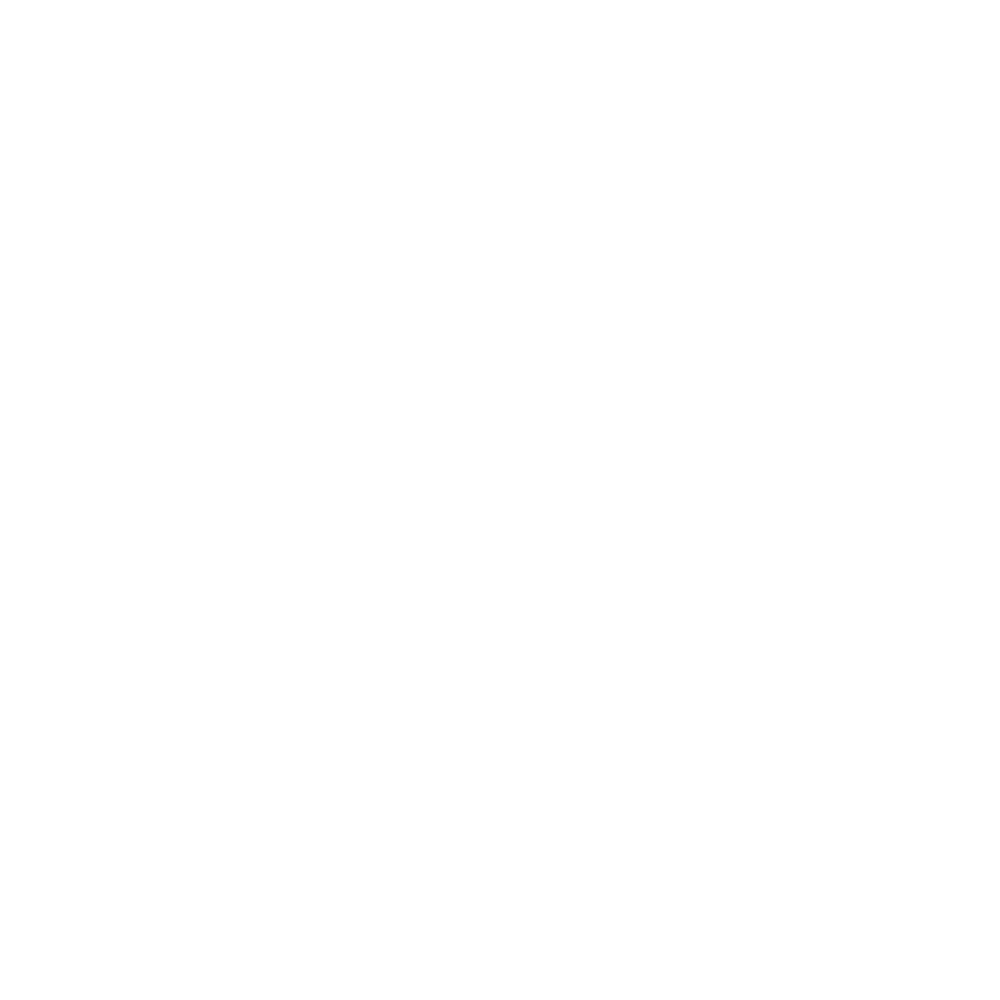

# Decentraland Teleporter System

A cinematic teleportation system for Decentraland SDK7 scenes with animated ripple effects and smooth camera transitions.

## Features

- **Animated Teleporter Pads**: Multi-layered planes with ripple animation effects
- **Cinematic Camera Transitions**: Smooth camera movement from teleporter to destination (DCL 2.0 Desktop Client only)
- **Customizable Textures**: Support for custom teleporter pad and logo textures
- **Text Labels**: Floating text labels above teleporters with billboard effect
- **Collision Detection**: Automatic teleportation when players step on the pad

## Demo



## Installation

1. Clone this repository into your Decentraland project
2. Copy the teleporter system files to your `src/` directory:
   - `src/teleporter.ts`
   - `src/components.ts` (add the Teleporter components)

3. Install dependencies:
```bash
npm install
```

## Usage

### Basic Setup

Import the teleporter system in your main scene file:

```typescript
import { createTeleporter, teleporterSystem, teleporterRippleSystem } from './teleporter'

export function main() {
  // Add required systems
  engine.addSystem(teleporterSystem)
  engine.addSystem(teleporterRippleSystem)

  // Create a teleporter
  createTeleporter(
    { x: 4, y: 0.5, z: 4 },              // Teleporter position
    { x: 4, y: 0.1, z: 24 },             // Destination position
    'images/teleporter-pad.png',          // Teleporter texture
    'images/logo.png',                    // Logo texture
    'Games'                               // Label text
  )
}
```

### Function Parameters

```typescript
createTeleporter(
  position: { x: number, y: number, z: number },
  destination: { x: number, y: number, z: number },
  textureSrc?: string,      // Default: 'images/teleporter-pad.png'
  logoTextureSrc?: string,  // Default: 'images/Commodore Logo.png'
  labelText?: string        // Default: 'Teleporter'
)
```

## Components

### Teleporter Pad
- **Main Plane**: Collision-enabled plane with teleporter texture
- **Ripple Layers**: 4 animated child planes with transparency effects
- **Logo Overlay**: Independent logo plane positioned above the pad

### Text Label
- **Billboard Text**: Always faces the player (X-axis rotation)
- **Position**: 2 meters above the teleporter pad
- **Styling**: White text with black outline

### Animation System
- **Ripple Effect**: Sine wave animation across layers
- **Phase Offset**: 0.25 phase difference between layers
- **Duration**: 1 second animation cycle

## Camera System

### Requirements
- **DCL 2.0 Desktop Client**: Virtual cameras only work in the desktop client
- **Local Testing**: Camera transitions disabled for local development

### Sequence
1. **Start Camera**: Positioned above teleporter, looking towards destination
2. **Transition**: 3-second smooth camera movement to destination
3. **Player Teleport**: Occurs when camera reaches destination
4. **Reset**: Returns to player camera after 1 second

## File Structure

```
src/
├── teleporter.ts          # Main teleporter system
├── components.ts          # ECS components (Teleporter, TeleporterRipple)
├── index.ts              # Scene entry point
└── ui.tsx                # Optional UI with test camera button

images/
├── teleporter-pad.png    # Main teleporter texture
└── logo.png             # Logo overlay texture
```

## Development

### Local Testing
```bash
npm run start
```
- Basic teleportation works
- Camera transitions disabled
- Ripple animations functional

### Production Deployment
```bash
npm run build
npm run deploy
```
- Full camera transitions enabled
- Requires DCL 2.0 Desktop Client for camera effects

### Testing Camera System
Use the included UI test button to verify virtual camera functionality:
```typescript
import { setupUi } from './ui'

// Enable UI for camera testing
setupUi()
```

## Customization

### Texture Requirements
- **Teleporter Pad**: Supports transparency (PNG recommended)
- **Logo**: Any image format, positioned independently
- **Size**: Textures are scaled to fit 2x2 unit planes

### Animation Settings
Modify animation parameters in `teleporterRippleSystem()`:
```typescript
const animationDuration = 1.0  // Animation cycle time
const phaseOffset = 0.25       // Phase difference between layers
```

### Camera Settings
Adjust camera positioning in `teleporterSystem()`:
```typescript
position: Vector3.create(teleporterPos.x, teleporterPos.y + 3, teleporterPos.z)
```

## Troubleshooting

### Camera Not Working
- Ensure you're testing in DCL 2.0 Desktop Client
- Check console logs for virtual camera creation messages
- Verify scene permissions in `scene.json`

### Teleporter Not Triggering
- Check player collision detection range (default: 1.5 units X/Z, 3 units Y)
- Verify teleporter position is accessible to players
- Check cooldown timer (prevents rapid teleporting)

### Animation Issues
- Ensure `teleporterRippleSystem` is added to engine
- Check material transparency settings
- Verify ripple components are being created

## Contributing

1. Fork the repository
2. Create a feature branch
3. Make your changes
4. Test in both local and deployed environments
5. Submit a pull request

## License

MIT License - feel free to use in your Decentraland scenes!

## Credits

Built for Decentraland SDK7 using Entity-Component-System architecture.